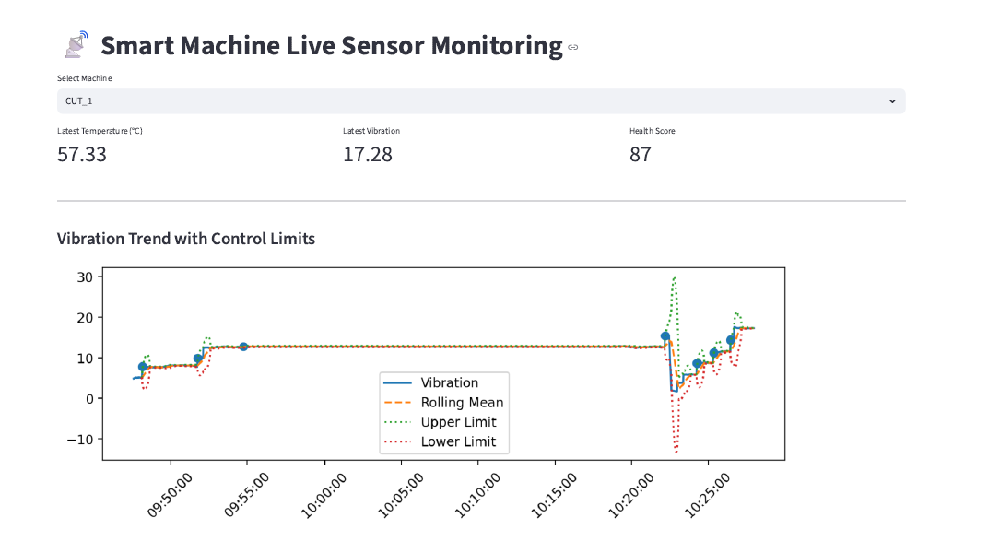
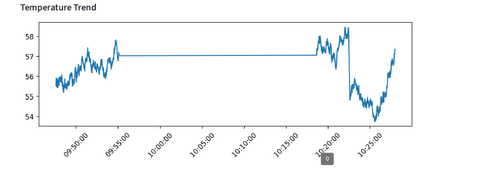
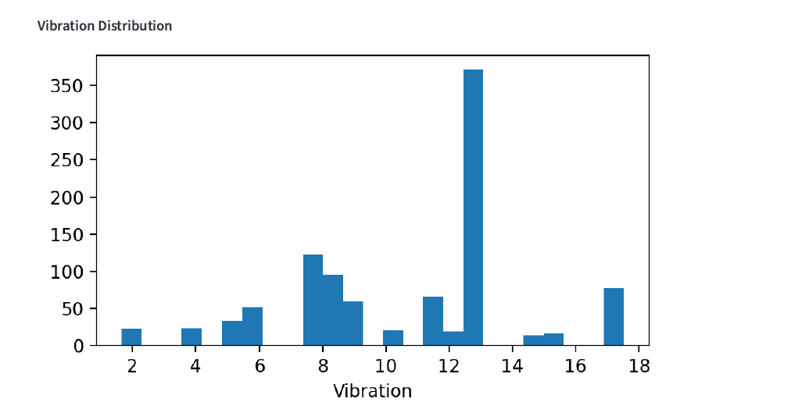
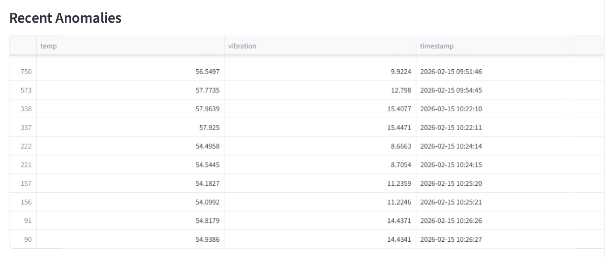
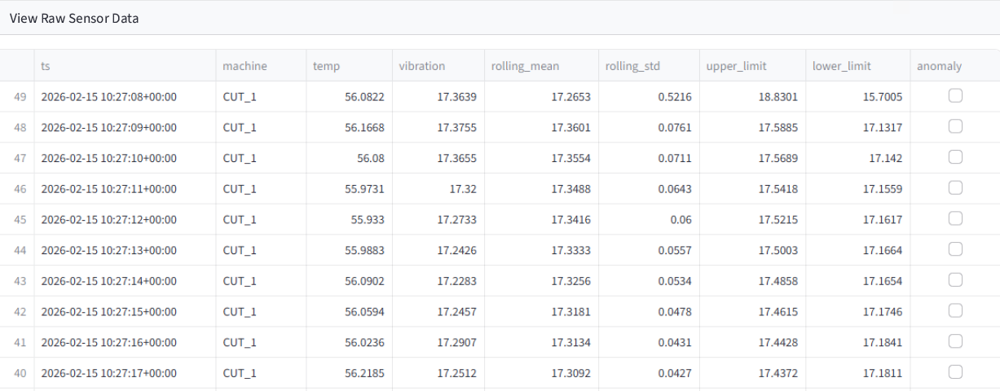

# IoT Sensor Ingestion & Live Monitoring Dashboard

This project demonstrates a simplified Industry 4.0 data pipeline pattern for smart manufacturing environments.

It simulates real-time machine sensor readings, ingests them into a database, and visualises live operational trends with basic anomaly detection to mimic predictive maintenance workflows.

---

## 🎯 Project Purpose

Modern smart factories rely on continuous sensor data to monitor equipment health, detect abnormal behaviour, and support data-driven decision-making.

This project demonstrates:

- Real-time sensor data generation (simulated edge device)
- Database ingestion using SQLite
- Live operational dashboard using Streamlit
- Statistical anomaly detection on vibration signals

The architecture mirrors a typical Industry 4.0 pattern:

Sensor Simulation → Database Storage → Real-Time Analytics → Operational Insight

---

## 🏗 Architecture Overview

1. **Sensor Simulation (Python)**
   - Generates temperature and vibration data at 1 Hz frequency
   - Introduces random anomalies to simulate machine faults

2. **Data Storage**
   - Writes sensor readings to a local SQLite database
   - Mimics time-series ingestion in manufacturing environments

3. **Live Dashboard (Streamlit)**
   - Displays latest temperature and vibration readings
   - Plots rolling time-series trends
   - Highlights anomalous readings

4. **Anomaly Detection**
   - Uses rolling mean and standard deviation
   - Flags values exceeding 3σ threshold
   - Demonstrates a simplified predictive maintenance concept

---

## 📊 Features

- Continuous sensor data simulation
- Real-time data ingestion
- Live visual monitoring dashboard
- Basic statistical anomaly detection
- Lightweight and easy to deploy

---

## 🧠 Manufacturing Relevance

This project reflects foundational components of a smart manufacturing ecosystem:

- Industrial IoT data capture
- Real-time production intelligence
- Condition monitoring
- Early fault detection patterns
- Data-driven operational visibility

Although simplified, the architecture can be extended to:
- Cloud ingestion (Azure/AWS IoT)
- Time-series databases
- Machine learning-based predictive models
- Integration with ERP/MES systems

---

## ⚙️ Technologies Used

- Python
- SQLite
- pandas
- NumPy
- Streamlit
- matplotlib

---

## 🚀 How To Run

### 1. Install dependencies

pip install pandas numpy streamlit matplotlib

---

## Output

